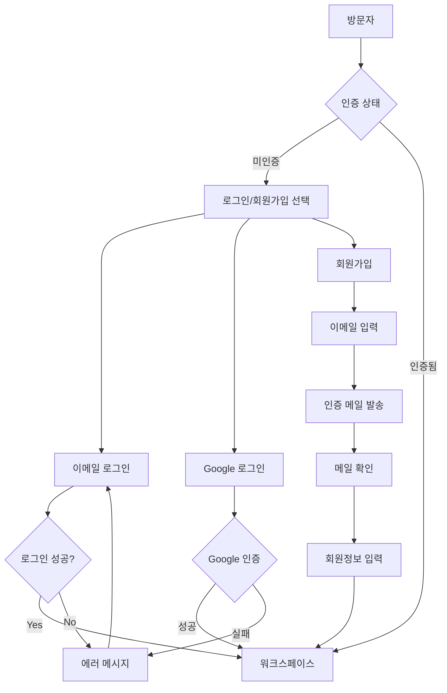

# 🔄 Authentication User Flows

인증 시스템의 상세한 사용자 플로우와 시나리오별 처리 방법을 정의합니다.

## 📊 플로우 개요



## 🎯 주요 사용자 플로우

### 1. 신규 회원가입 플로우

#### Happy Path (정상 경로)
```
Step 1: 회원가입 시작
👤 사용자 행동: 메인 페이지에서 "회원가입" 클릭
🖥️ 시스템 응답: /sign-up 페이지로 이동

Step 2: 이메일 입력
👤 사용자 행동: 이메일 주소 입력 후 "인증메일 발송" 클릭
🖥️ 시스템 응답: 
  - useSignUp.registerEmail() 호출
  - 로딩 상태 표시 ("인증메일 발송 중...")
  - API: POST /v1/user/register-email

Step 3: 인증 메일 발송
🖥️ 시스템 응답:
  - 성공 시: /sign-up/complete 페이지로 이동
  - "이메일을 확인해주세요" 메시지 표시
  - 재발송 버튼 제공

Step 4: 이메일 확인
👤 사용자 행동: 이메일의 인증 링크 클릭
🖥️ 시스템 응답:
  - /complete-registration?token=xxx 페이지로 이동
  - useSignUp.getRegistrationInfo() 호출
  - 토큰 검증 및 이메일 정보 로드

Step 5: 회원정보 입력
👤 사용자 행동: 이름, 비밀번호 입력 후 "가입완료" 클릭
🖥️ 시스템 응답:
  - useSignUp.completeRegistration() 호출
  - 자동 로그인 (토큰 저장)
  - 워크스페이스로 리다이렉트
```

#### Edge Cases (예외 상황)
```
중복 이메일:
👤 사용자: 이미 가입된 이메일로 회원가입 시도
🖥️ 시스템: "이미 가입된 이메일입니다. 로그인해주세요" 에러
🔄 해결: 로그인 페이지로 안내 링크 제공

만료된 토큰:
👤 사용자: 10분 후 인증 링크 클릭
🖥️ 시스템: "인증 링크가 만료되었습니다" 에러 페이지
🔄 해결: 재발송 버튼으로 새로운 인증 메일 요청

잘못된 토큰:
👤 사용자: 변조된 링크 접근
🖥️ 시스템: "유효하지 않은 링크입니다" 에러
🔄 해결: 회원가입 페이지로 돌아가기 버튼

네트워크 오류:
👤 사용자: 이메일 발송 시 네트워크 실패
🖥️ 시스템: "네트워크 오류가 발생했습니다. 다시 시도해주세요"
🔄 해결: 재시도 버튼 제공
```

### 2. 로그인 플로우

#### 이메일/비밀번호 로그인
```
Step 1: 로그인 시작
👤 사용자 행동: 메인 페이지에서 "로그인" 클릭
🖥️ 시스템 응답: /sign-in 페이지로 이동

Step 2: 자격증명 입력
👤 사용자 행동: 이메일, 비밀번호 입력 후 "로그인" 클릭
🖥️ 시스템 응답:
  - useSignIn.signIn() 호출
  - 로딩 상태 표시 ("로그인 중...")
  - API: POST /v1/user/sign-in

Step 3: 인증 성공
🖥️ 시스템 응답:
  - JWT 토큰 저장 (메모리 + 쿠키)
  - useAuthStore.setAuthenticatedUser() 호출
  - 워크스페이스로 리다이렉트 (replace: true)
```

#### Google OAuth 로그인
```
Step 1: Google 로그인 시작
👤 사용자 행동: "Google로 로그인" 버튼 클릭
🖥️ 시스템 응답: Google OAuth 팝업 창 열기

Step 2: Google 인증
👤 사용자 행동: Google 계정 선택 및 권한 승인
🖥️ 시스템 응답:
  - Google access_token 수신
  - useGoogleSignIn.signIn() 호출
  - API: POST /v1/user/google

Step 3: 인증 처리
🖥️ 시스템 응답:
  - 기존 계정 존재 시: 로그인 완료
  - 신규 계정 시: 자동 회원가입 후 로그인
  - 워크스페이스로 리다이렉트
```

### 3. 패스워드 리셋 플로우

#### 리셋 요청
```
Step 1: 리셋 시작
👤 사용자 행동: 로그인 페이지에서 "비밀번호 찾기" 클릭
🖥️ 시스템 응답: /reset-password 페이지로 이동

Step 2: 이메일 입력
👤 사용자 행동: 계정 이메일 입력 후 "리셋링크 발송" 클릭
🖥️ 시스템 응답:
  - usePasswordReset.requestReset() 호출
  - API: POST /v1/user/reset-password
  - "이메일을 확인해주세요" 메시지

Step 3: 리셋 메일 확인
👤 사용자 행동: 이메일의 리셋 링크 클릭 (10분 이내)
🖥️ 시스템 응답:
  - /reset-password/confirm?token=xxx 페이지로 이동
  - 토큰 검증: POST /v1/user/verify-reset-token

Step 4: 새 비밀번호 설정
👤 사용자 행동: 새 비밀번호 입력 후 "설정 완료" 클릭
🖥️ 시스템 응답:
  - usePasswordReset.confirmReset() 호출
  - API: POST /v1/user/confirm-reset-password
  - "비밀번호가 변경되었습니다" 메시지
  - 로그인 페이지로 리다이렉트
```

## 🔒 보안 시나리오

### 토큰 만료 처리
```
Access Token 만료 (15분):
🖥️ 자동 처리: axios interceptor가 401 감지
  → refresh token으로 새 access token 요청
  → 원래 API 요청 재시도
  → 사용자는 중단 없이 계속 사용

Refresh Token 만료 (7일):
🖥️ 자동 처리: refresh 실패 시
  → 모든 토큰 삭제
  → 로그인 페이지로 리다이렉트
  → "세션이 만료되었습니다. 다시 로그인해주세요"

인증 링크 만료 (10분):
👤 사용자: 만료된 링크 클릭
🖥️ 시스템: 에러 페이지 표시
🔄 해결: "새로운 인증 메일 받기" 버튼 제공
```

### 동시 세션 관리
```
다른 기기에서 로그인:
🖥️ 시스템: refresh token rotation으로 기존 세션 무효화
👤 사용자: 기존 기기에서 자동 로그아웃
💡 알림: "다른 기기에서 로그인되어 로그아웃되었습니다"

의심스러운 활동:
🖥️ 시스템: 이상한 IP/위치에서 로그인 시도
📧 알림: 보안 알림 이메일 발송
🔒 보안: 계정 잠금 및 패스워드 리셋 요구
```

## 📱 반응형 고려사항

### 모바일 환경
```
터치 인터페이스:
- 버튼 최소 크기: 44px (터치 가능 영역)
- 입력 필드 간격: 충분한 여백으로 오터치 방지
- 폰트 크기: 최소 16px (iOS 자동 줌 방지)

키보드 처리:
- 입력 필드 포커스 시 키보드 영역 고려
- 제출 버튼이 키보드에 가려지지 않도록 스크롤
- iOS/Android 키보드 차이 대응

네트워크 고려:
- 느린 네트워크에서 로딩 상태 명확히 표시
- 요청 실패 시 재시도 버튼 제공
- 오프라인 상태 감지 및 알림
```

### 접근성 고려사항
```
스크린 리더:
- 폼 필드에 명확한 라벨 연결
- 에러 메시지에 aria-describedby 속성
- 페이지 제목과 헤딩 구조 명확히

키보드 네비게이션:
- Tab 순서 논리적으로 구성
- Enter 키로 폼 제출 가능
- Esc 키로 모달/팝업 닫기

시각적 피드백:
- 포커스 표시 명확히 (outline)
- 색상에만 의존하지 않는 상태 표시
- 충분한 명도 대비 (4.5:1 이상)
```

## 🔄 상태 전환 다이어그램

### 인증 상태 관리
```
[미인증] --로그인 성공--> [인증됨]
[인증됨] --로그아웃--> [미인증]
[인증됨] --토큰 만료--> [미인증]
[미인증] --페이지 새로고침--> [로딩] --토큰 확인--> [미인증|인증됨]
```

### 회원가입 단계
```
[시작] --이메일 입력--> [메일 발송됨] --링크 클릭--> [정보 입력] --완료--> [인증됨]
[메일 발송됨] --재발송--> [메일 발송됨]
[정보 입력] --토큰 만료--> [에러]
[에러] --재시도--> [시작]
```

## 📈 성능 최적화 플로우

### 지연 로딩
```
초기 로드: 로그인/회원가입 페이지만 로드
인증 후: 워크스페이스 컴포넌트 지연 로딩
라우트 분할: React.lazy()로 코드 스플리팅
```

### 캐싱 전략
```
사용자 정보: Zustand store에 메모리 캐싱
토큰: 메모리 (access) + 쿠키 (refresh)
정적 자원: 브라우저 캐시 활용
```

이러한 플로우를 통해 사용자는 직관적이고 안전한 인증 경험을 제공받을 수 있습니다.