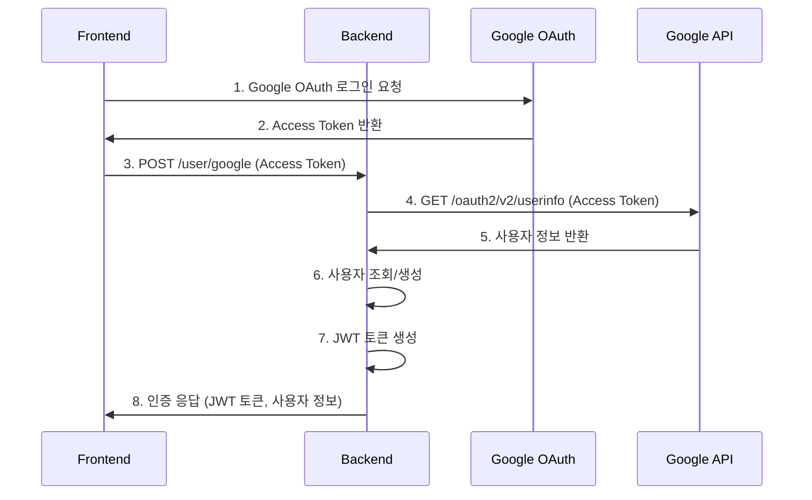

# Google OAuth Access Token 인증 명세서

## 개요

이 프로젝트는 프론트엔드에서 Google OAuth Access Token을 받아서 백엔드로 전송하고, 백엔드에서 해당 토큰으로 Google UserInfo API를 호출하여 사용자 정보를 가져온 후 회원가입 또는 로그인을 처리하는 방식으로 구현되어 있습니다.

## 인증 플로우



## API 엔드포인트

### 1. Google OAuth 인증

**Endpoint:** `POST /user/google`

**Request Body:**

```json
{
  "access_token": "string" // Google OAuth Access Token
}
```

**Success Response (200):**

```json
{
  "message": "Authentication successful",
  "user": {
    "uuid": "string",
    "name": "string",
    "email": "string"
  },
  "access_token": "string" // JWT Access Token
}
```

**Error Responses:**

- `400 Bad Request`: Access Token이 누락된 경우
- `401 Unauthorized`: 유효하지 않은 Access Token인 경우

**특징:**

- Refresh Token은 HttpOnly 쿠키로 자동 설정됨 (7일 만료)
- 기존 사용자는 로그인, 신규 사용자는 자동 회원가입 처리

### 2. 토큰 갱신

**Endpoint:** `POST /user/refresh`

**Request:** 쿠키에서 refresh_token 자동 읽음

**Success Response (200):**

```json
{
  "message": "Token refreshed successfully",
  "access_token": "string" // 새로운 JWT Access Token
}
```

### 3. 로그아웃

**Endpoint:** `POST /user/logout`

**Success Response (200):**

```json
{
  "message": "Logged out successfully"
}
```

## 데이터 구조

### Google UserInfo API 응답

```typescript
interface GoogleUserInfo {
  id: string; // Google 사용자 ID
  email: string; // 이메일 주소
  verified_email: boolean; // 이메일 인증 여부
  name: string; // 사용자 이름
  given_name: string; // 이름
  family_name: string; // 성
  picture?: string; // 프로필 이미지 URL
  locale?: string; // 지역 설정
}
```

### OAuth 사용자 정보 (내부)

```typescript
interface OAuthUser {
  provider_id: string; // Google 사용자 ID
  email: string; // 이메일 주소
  name: string; // 사용자 이름
  picture?: string; // 프로필 이미지 URL
  access_token: string; // Google Access Token
}
```

### JWT 토큰 페이로드

```typescript
interface JwtTokenDto {
  user_uuid: string; // 사용자 UUID
}
```

## 환경 변수

### Backend 필수 환경 변수

```env
# Application Settings
NODE_ENV=development
PORT=80

# Database Settings
DB_HOST=localhost
DB_PORT=5432
DB_USER=postgres
DB_PASS=your_password
DB_DATABASE=your_db_name

# Google OAuth Settings
GOOGLE_CLIENT_ID=your_google_client_id
GOOGLE_CLIENT_SECRET=your_google_client_secret

# JWT Settings
JWT_ACCESS_SECRET=your_jwt_access_secret_key
JWT_REFRESH_SECRET=your_jwt_refresh_secret_key
ACCESS_TOKEN_EXPIRES_IN=15m
REFRESH_TOKEN_EXPIRES_IN=7d

# Frontend Settings
FRONTEND_URL=http://localhost:80
```

### Frontend 설정

```env
VITE_GOOGLE_CLIENT_ID=your_google_client_id
```

## 프론트엔드 구현 가이드

### 1. Google OAuth 라이브러리 설치

```bash
npm install @react-oauth/google
```

### 2. Google OAuth Provider 설정

```jsx
import { GoogleOAuthProvider } from "@react-oauth/google";

function App() {
  return (
    <GoogleOAuthProvider clientId="your_google_client_id">
      {/* 앱 컴포넌트 */}
    </GoogleOAuthProvider>
  );
}
```

### 3. 로그인 버튼 구현

```jsx
import { useGoogleLogin } from "@react-oauth/google";

function LoginButton() {
  const login = useGoogleLogin({
    onSuccess: async (tokenResponse) => {
      try {
        const response = await fetch("/api/user/google", {
          method: "POST",
          headers: { "Content-Type": "application/json" },
          body: JSON.stringify({
            access_token: tokenResponse.access_token,
          }),
          credentials: "include", // 쿠키 포함
        });

        const result = await response.json();
        // JWT 토큰 저장 및 사용자 정보 처리
        localStorage.setItem("accessToken", result.accessToken);
      } catch (error) {
        console.error("Login failed:", error);
      }
    },
    onError: (error) => {
      console.error("Google login failed:", error);
    },
  });

  return <button onClick={login}>Google로 로그인</button>;
}
```

## 데이터베이스 스키마

### User 테이블

- `id`: Primary Key
- `uuid`: Unique identifier
- `name`: 사용자 이름
- `email`: 이메일 주소
- `password`: 비밀번호 (OAuth 사용자는 null)
- `created_at`, `updated_at`, `deleted_at`: 타임스탬프

### Oauth 테이블

- `id`: Primary Key
- `user_id`: User 테이블 Foreign Key
- `provider`: OAuth 제공자 (google, apple, facebook)
- `provider_id`: 제공자별 사용자 ID
- `origin_response`: 원본 응답 데이터 (JSONB)
- `created_at`, `updated_at`, `deleted_at`: 타임스탬프

### RefreshToken 테이블 (리프레시 토큰 화이트리스트)

- `id`: Primary Key
- `user_id`: User 테이블 Foreign Key
- `token_hash`: 리프레시 토큰의 SHA-256 해시값 (64자)
- `expires_at`: 토큰 만료 시간
- `created_at`, `updated_at`, `deleted_at`: 타임스탬프

## 보안 고려사항

### 1. 토큰 보안

- **Access Token**: 짧은 만료시간 (15분) 설정
- **Refresh Token**: HttpOnly 쿠키로 저장하여 XSS 공격 방지
- **리프레시 토큰 화이트리스트**: 유효한 토큰만 데이터베이스에 저장
- **토큰 해시 저장**: 실제 토큰이 아닌 SHA-256 해시값 저장
- **토큰 재사용 방지**: 토큰 갱신 시 기존 토큰 무효화
- **자동 만료 처리**: 만료된 토큰 자동 정리
- **쿠키 보안 옵션**: `httpOnly`, `secure`, `sameSite: strict`

### 2. API 보안

- Google UserInfo API 호출 시 HTTPS 사용
- 토큰 검증 실패 시 적절한 에러 응답
- 사용자 정보는 필요한 필드만 응답에 포함

### 3. 데이터베이스 보안

- OAuth 정보와 사용자 정보 분리 저장
- 민감한 정보는 암호화하여 저장

## 에러 처리

### 일반적인 에러 상황

1. **유효하지 않은 Access Token**: Google API 호출 실패 시 401 에러 반환
2. **네트워크 에러**: Google API 연결 실패 시 적절한 에러 메시지 반환
3. **사용자 생성 실패**: 데이터베이스 에러 시 500 에러 반환
4. **토큰 갱신 실패**: Refresh Token 만료 시 401 에러로 재로그인 유도

### 프론트엔드 에러 처리 예제

```javascript
try {
  const response = await fetch("/api/user/google", {
    method: "POST",
    headers: { "Content-Type": "application/json" },
    body: JSON.stringify({ access_token: accessToken }),
    credentials: "include",
  });

  if (!response.ok) {
    if (response.status === 401) {
      // 토큰 무효, 재로그인 필요
      handleRelogin();
    } else if (response.status === 400) {
      // 잘못된 요청
      throw new Error("잘못된 요청입니다.");
    }
    throw new Error(`HTTP error! status: ${response.status}`);
  }

  const result = await response.json();
  // 성공 처리
} catch (error) {
  console.error("Authentication failed:", error);
  // 사용자에게 에러 메시지 표시
}
```

## 향후 확장 가능성

### 1. 추가 OAuth 제공자

- Apple, Facebook 등 다른 OAuth 제공자 지원 가능
- OauthProviderEnum에 새로운 제공자 추가

### 2. 사용자 정보 확장

- 프로필 이미지 업로드 기능
- 추가 사용자 정보 수집 및 관리

### 3. 세션 관리

- Redis를 이용한 세션 관리
- 다중 디바이스 로그인 제어

### 4. 감사 로그

- 로그인/로그아웃 기록
- API 호출 로그 관리
